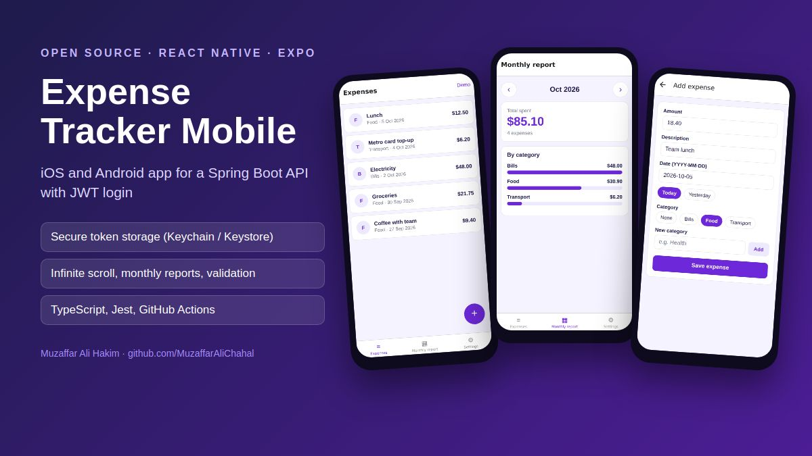
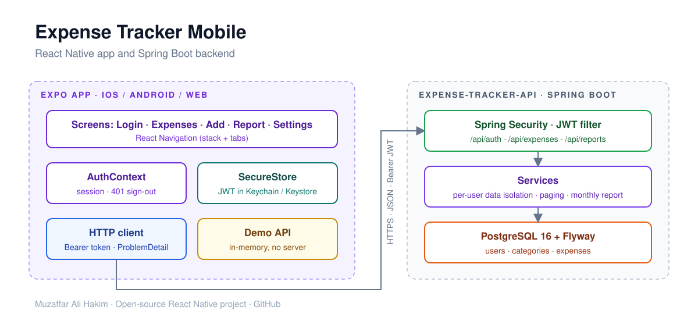

# Expense Tracker Mobile (React Native + Expo)


   

An iOS and Android app for my [Secure Expense Tracker API](https://github.com/MuzaffarAliChahal/expense-tracker-api) (Java 21, Spring Boot, Spring Security JWT).
Users sign in, log expenses in a few taps, and see where their money went each month.

**Try it in the browser:** [muzaffaralichahal.github.io/expense-tracker-mobile](https://muzaffaralichahal.github.io/expense-tracker-mobile/) (tap *Try the demo*, no server needed)



## Features

- **JWT login and registration** against the Spring Boot API; the token is stored in the **iOS Keychain / Android Keystore** with `expo-secure-store`
- Automatic sign-out when the API returns **401** (expired token)
- **Expenses list** with pull-to-refresh, **infinite scroll** over the paged API, and long-press to delete
- **Add expense** form with client-side validation that mirrors the server rules (amount, 2 decimals, no future dates), quick date chips, and inline category creation
- **Monthly report** with month navigation and per-category bars
- Server-side validation errors (RFC 7807 `ProblemDetail`) shown next to the right field
- **Offline demo mode** with an in-memory copy of the API, so reviewers can try the app in Expo Go without a backend
- **Tests** with Jest (`jest-expo`): HTTP client, demo API and validation; TypeScript strict mode
- **CI** on GitHub Actions: type-check, tests, Android bundle; the web build is deployed to GitHub Pages



## Run it

```bash
npm install
npx expo start          # scan the QR code with Expo Go, or press a / i / w
```

To use the real backend, start [expense-tracker-api](https://github.com/MuzaffarAliChahal/expense-tracker-api) (`docker compose up`) and set the API URL in **Settings**:

| Where the app runs | API URL |
| --- | --- |
| Android emulator | `http://10.0.2.2:8080` (default) |
| iOS simulator | `http://localhost:8080` |
| Physical phone | `http://<your-computer-LAN-IP>:8080` |

```bash
npm test                # Jest
npm run typecheck       # tsc --noEmit
```

The screenshot at the top is generated from the real web build by [`scripts/readme-screenshots.mjs`](scripts/readme-screenshots.mjs) (Playwright). Run the **Update README screenshots** workflow in the Actions tab to refresh it.

## Project structure

```
App.tsx                       # navigation: auth stack, tabs, add-expense modal
src/
├── api/
│   ├── client.ts             # typed fetch client, JWT header, ProblemDetail errors
│   ├── demo.ts               # in-memory API for demo mode
│   └── types.ts
├── auth/
│   ├── AuthContext.tsx       # session state, login/register/demo/logout
│   └── storage.ts            # SecureStore (native) / localStorage (web)
├── screens/                  # Login, Expenses, AddExpense, Report, Settings
├── components/ui.tsx         # Card, Field, Button, Banner
└── utils/                    # formatting and validation
__tests__/                    # Jest tests
```

## License

MIT
